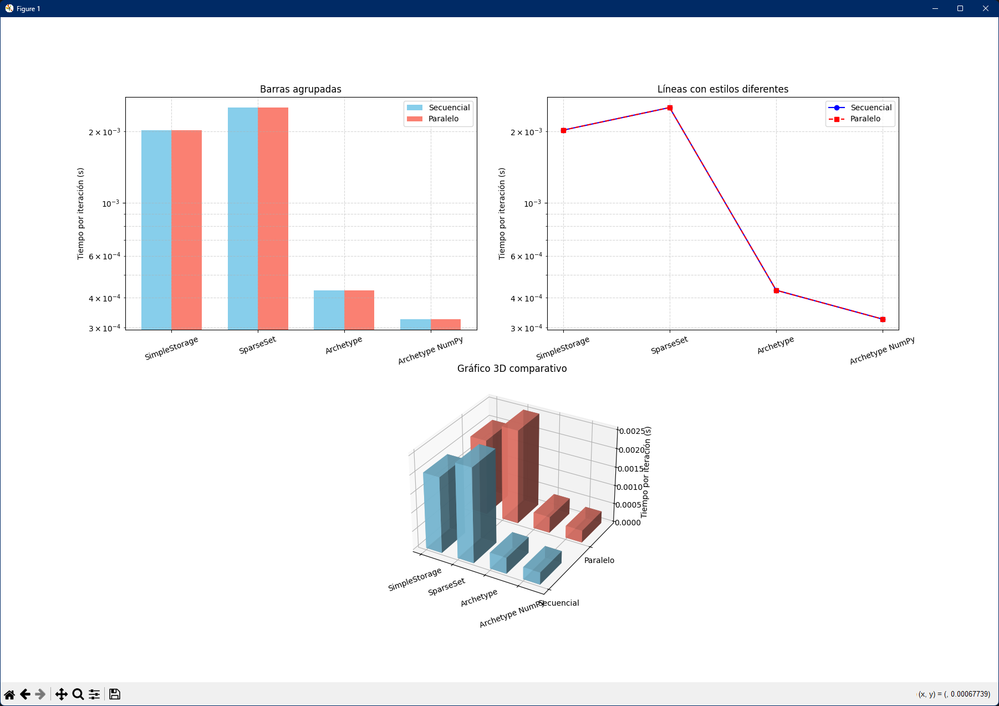
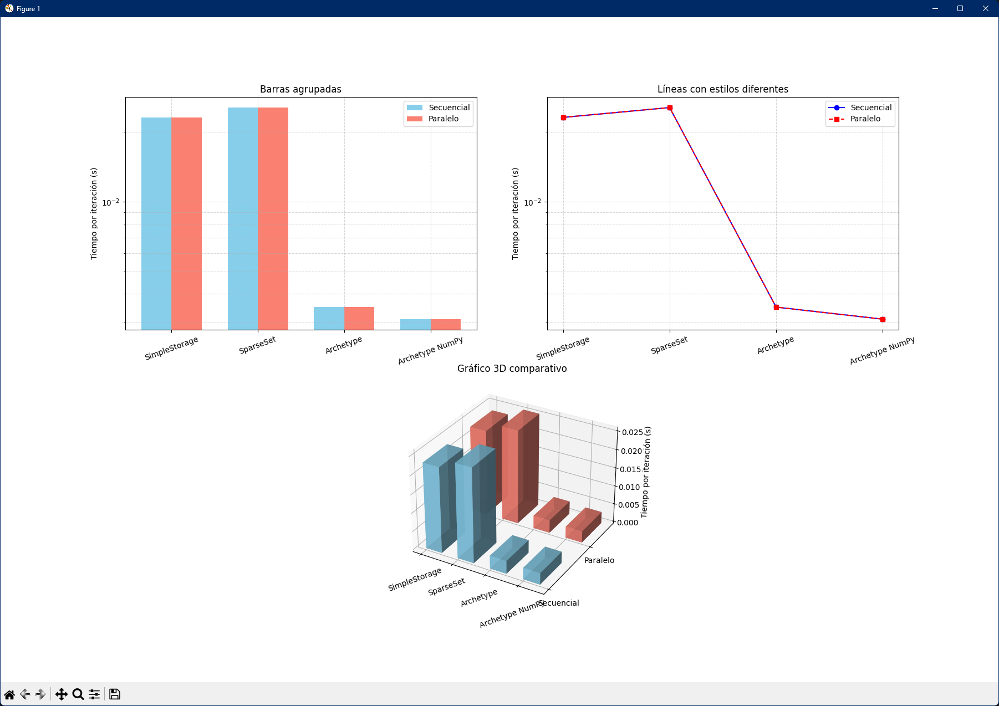

# ECS (Ponencia Universidad Antonio de Nebrija)

Este proyecto es una implementación educativa y optimizada de un **ECS (Entity-Component-System)** en Python, diseñada para explorar diferentes estrategias de almacenamiento de componentes y realizar micro-benchmarks de rendimiento. Soporta **SimpleStorage**, **SparseSet** y **Archetype/Chunk**, incluyendo aceleración con **NumPy**, planificación de sistemas y profiling.

---

## Características

* **Entity Manager**: Gestión eficiente de creación y destrucción de entidades.
* **Almacenamiento de componentes**:

  * **SimpleStorage**: Diccionarios por componente.
  * **SparseSet**: Almacenamiento con arreglo denso y mapeo disperso.
  * **Archetype/Chunk**: Organización por esquemas de componentes, optimizada con NumPy.
* **Sistemas y Scheduler**:

  * Definición de sistemas con componentes leídos y escritos.
  * Resolución automática de dependencias entre sistemas para ejecución secuencial o paralela.
* **Benchmarking**:

  * Comparación de rendimiento entre SimpleStorage, SparseSet y Archetype.
  * Soporte de ejecución multithread.
  * Opcional: profiling detallado con `cProfile`.

---

## Estructura del proyecto

### 1. **Entity Manager**

Clase `EntityManager` que asigna IDs únicos a entidades y recicla IDs eliminados.

```python
em = EntityManager()
eid = em.create()
em.destroy(eid)
```

---

### 2. **Almacenamiento de componentes**

#### a) SimpleStorage

Diccionarios de componentes para cada entidad.

```python
simple = SimpleStorage()
simple.add("pos", eid, (x, y))
val = simple.get("pos", eid)
```

#### b) SparseSet

Optimización para acceso rápido y eliminación eficiente.

```python
sparse = SparseSet()
sparse.add(eid, value)
sparse.get(eid)
```

#### c) Archetype / Chunk

Agrupa entidades por **esquema de componentes** para un acceso más eficiente.

* Soporta aceleración con **NumPy** para operaciones vectorizadas.
* `NumpyChunk` usa arrays de NumPy para `pos`, `vel` y `health`.

```python
arche = ArchetypeManager(chunk_capacity=128, use_numpy=True)
arche.add_entity(("pos","vel","health"), eid, {"pos":(x,y), "vel":(vx,vy), "health":100})
```

---

### 3. **Sistemas y Scheduler**

Cada sistema define:

* Componentes leídos (`read`)
* Componentes escritos (`write`)
* Función que actualiza el estado del mundo

```python
move_system = System("move", read={"pos","vel"}, write={"pos"}, func=sys_move_archetype)
world.register_system(move_system)
world.schedule_and_run(parallel=True, use_threads=True)
```

El scheduler:

* Construye un **grafo de dependencias** entre sistemas.
* Detecta ciclos y genera niveles de ejecución.
* Permite ejecución paralela con `ThreadPoolExecutor`.

---

### 4. **World**

La clase `World` centraliza:

* Manejo de entidades y componentes.
* Sistemas registrados y ejecución programada.
* Soporte de los tres tipos de almacenamiento:

  * SimpleStorage
  * SparseSet
  * Archetype (opcional con NumPy)

---

### 5. **Sistemas de ejemplo**

* Movimiento (`sys_move_*`): actualiza `pos` usando `vel`.
* Daño (`sys_damage_*`): decrementa `health`.

Se implementan versiones para SimpleStorage, SparseSet y Archetype.

---

### 6. **Benchmark**

Permite medir el rendimiento de diferentes estrategias:

```python
bench(n_entities=100000, iters=20, profile=False)
```

* Compara **SimpleStorage**, **SparseSet** y **Archetype (con y sin NumPy)**.
* Ejecuta cada benchmark en paralelo con multithreading.
* Opcional: profiling detallado.

---

### 7. **CLI**

Ejecutable desde la terminal:

```bash
python -m benchmark -n 100000 -i 20 --profile
```

Opciones:

* `-n, --entities`: número de entidades.
* `-i, --iters`: iteraciones del benchmark.
* `--profile`: activar profiling.

---

## Requisitos

* Python 3.8+
* Opcional: NumPy (`pip install numpy`) para optimización de Archetypes.

---

## Benchmark with 10,000 entities


## Benchmark with 100,000 entities


## Benchmark with 1,000,000 entities
